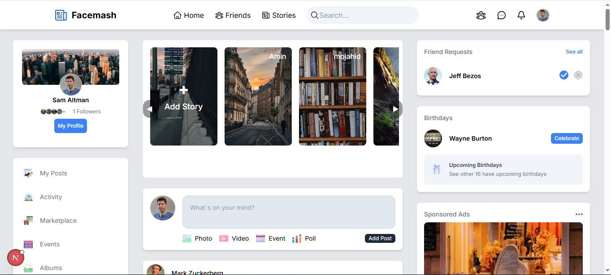
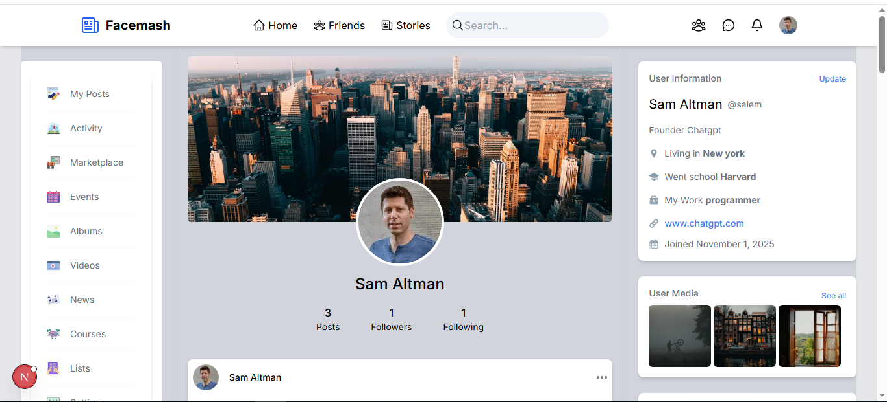

📱 Next Social — Facebook-like Social Media Project

A full-featured social media platform built as a hands-on experiment to understand how social networks work under the hood.

🚀 Features

📝 Create Posts with text and images.

💬 Comment System on posts.

❤️ Like System for posts and comments.

👥 Add & Follow Friends easily.

🚫 Block Users feature.

🙍‍♂️ Personal Profile Page that includes:

Profile and cover photos.

User information (name, job, location, etc.).

Ability to edit personal info.

🔐 Authentication via Clerk – signup and login with modern session management.

🧩 Tech Stack

Next.js 15 – Full-stack React framework for both frontend & backend logic.

TypeScript – Type safety and code scalability.

Tailwind CSS – Fast and modern UI styling.

Prisma ORM – Database modeling and queries.

PostgreSQL – Relational database.

Clerk – Authentication and user management.

🌱 Future Improvements

The project is designed to be easily extendable with more social features, including:

🔁 Reply to comments.

👍 Like comments and replies.

🔁 Share Post

📸 Add Stories.

🎞️ Add Reels (short videos).

🔔 Real-time notifications.

💬 Direct chat and messaging system.

🎯 Project Goal

This project was built as a learning experience to explore how social media platforms operate —
from user management and authentication to posts, interactions, and social connections.
It was an enriching and enjoyable experience that deepened my understanding of modern web app architecture.

🧪 Screenshots

🏠 Home Page :

 

 
 Profile Page :

 

 👨‍💻 Developer

 Boudina Boubaker

💼 LinkedIn : https://www.linkedin.com/in/boubaker-boudina-874253147/

🌐 Portfolio : https://my-portfolio-three-theta-30.vercel.app/

📧 Email: boubkerboudinadev@email.com
